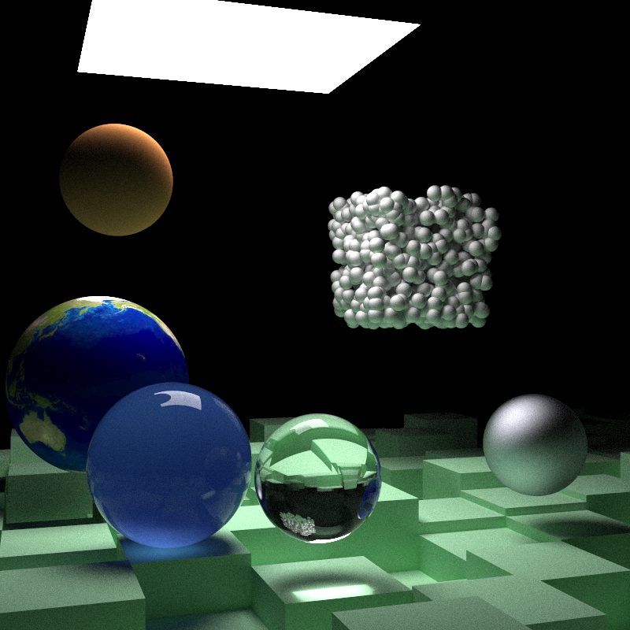

==========
ray-tracer
==========

.. default-role:: math

A toy ray-tracing renderer in Rust

Quick start
===========

.. code-block:: bash

    cargo run --release > image.ppm

``--release`` can significantly increase rendering speed.

References
==========

.. [book-i] `Ray Tracing in One Weekend <https://raytracing.github.io/books/RayTracingInOneWeekend.html>`_